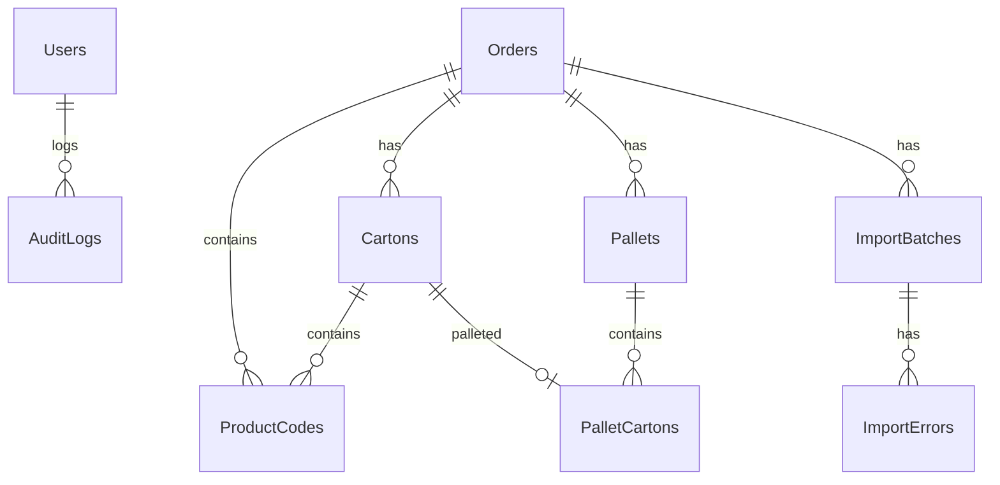

# Implementation Plan - Track Trace / Rusya Kozmetik Aggregation / Koli-Palet Yönetim Sistemi MVP

Bu plan, Rusya Kozmetik Aggregation (Koli-Palet Yönetim Sistemi) için geliştirilecek olan production-ready MVP'nin (Minimum Viable Product) teknik detaylarını, mimarisini ve dizin yapısını içermektedir.

---

## Proje Klasör Yapısı
Proje monorepo şeklinde tasarlanacak ve aşağıdaki klasör yapısına sahip olacaktır:

```
/track-trace
  /backend
    /src
      /TrackTrace.Domain          --> Entity'ler, Enum'lar, Arayüzler
      /TrackTrace.Application     --> CQRS (MediatR), DTO'lar, Validation'lar, Business logic
      /TrackTrace.Infrastructure  --> Dapper DbContext, Npgsql, JWT, Serilog, CsvHelper/Excel
      /TrackTrace.Api             --> Minimal API Endpoint'leri, Program.cs, Middleware'ler
    /tests
  /frontend
    /src
      /assets
      /components                 --> Yeniden kullanılabilir UI bileşenleri
      /pages                      --> Sayfa bileşenleri (Dashboard, Scan, Orders vb.)
      /hooks                      --> Custom hooks (React Query, Scanner hooks)
      /services                   --> API istekleri (Axios/Fetch)
      /context                    --> Auth ve global state yönetimi
      /index.css                  --> Global CSS ve premium stil tanımları
  /docker
    /nginx
      /nginx.conf                 --> Frontend için SPA yönlendirme destekli nginx yapılandırması
  /docs                           --> Dokümantasyonlar ve örnek barkod şablonları
  .github
    /workflows
      /ci.yml                     --> GitHub Actions CI pipeline
  .gitignore
  .env.example
  docker-compose.example.yml
  docker-compose.coolify.yml
  README.md
```

---

## Veritabanı Tasarımı (PostgreSQL 16)
Büyük veriyi (500.000+ ürün barkodu) desteklemek amacıyla veritabanı tabloları ve kritik indeksler aşağıdaki gibi tasarlanacaktır.

### Tablolar ve İlişkiler



#### SQL Migrations (`/backend/src/TrackTrace.Infrastructure/Data/Migrations/001_Initial_Setup.sql`)
1. **Users**: Kullanıcı hesapları.
2. **Orders**: Sipariş bilgileri.
3. **ImportBatches**: Ürün kodu yükleme paketleri.
4. **ImportErrors**: Hatalı satır detayları.
5. **Cartons**: Koli bilgileri.
6. **Pallets**: Palet bilgileri.
7. **PalletCartons**: Palet-Koli ilişkisi.
8. **ProductCodes**: Ürün barkodları (RawCode, GTIN, SerialNo, Status).
9. **PrintJobs**: Yazdırma logları.
10. **AuditLogs**: Sistem logları.

### İndeks Stratejisi
* `ProductCodes(RawCode)` UNIQUE index (Hızlı arama ve mükerrer kayıt kontrolü için).
* `ProductCodes(OrderId, Status)` (Sipariş bazlı okuma istatistikleri için).
* `ProductCodes(CartonId)` (Koli içi ürün listelemeleri için).
* `Cartons(OrderId, Status)` ve `Pallets(OrderId, Status)`.
* `Cartons(SSCC)` ve `Pallets(SSCC)`.
* `AuditLogs(EntityName, EntityId)` ve `AuditLogs(CreatedAt)`.

---

## Backend Mimarisi (.NET 8 Minimal API)

### 1. Domain Katmanı
Entity sınıfları ve durum enum'ları tanımlanacaktır:
* **Enums**: `OrderStatus` (Draft, Active, Completed, Cancelled), `ProductCodeStatus` (Uploaded, Scanned, Packed, Shipped), `CartonStatus` (Open, Closed, Printed, Palletized), `PalletStatus` (Open, Closed, Printed, Shipped), `UserRole` (Admin, Operator, Viewer).
* **Entities**: `User`, `Order`, `ProductCode`, `Carton`, `Pallet`, `PalletCarton`, `ImportBatch`, `ImportError`, `PrintJob`, `AuditLog`.

### 2. Application Katmanı
CQRS deseni için `MediatR` kullanılacaktır. İş kuralları bu katmanda yer alacaktır:
* **Auth**: `LoginCommand` -> JWT token döner.
* **Orders**: CRUD, `ActivateOrderCommand`, `CompleteOrderCommand`.
* **Imports**: `ImportProductCodesCommand` (CsvHelper / Stream okuma, Dapper bulk insert, validation).
* **Scan**: `ScanProductCommand` (Barkod okuma mantığı: Row locking ve Transaction ile çifte okuma engelleme).
* **Cartons / Pallets**: `CloseCartonCommand`, `PrintCartonLabelCommand`, `AddCartonToPalletCommand`.

### 3. Infrastructure Katmanı
* **Dapper & Npgsql**: Veritabanı bağlantısı ve hızlı bulk ekleme işlemleri.
* **JWT Service**: Token üretimi ve doğrulama.
* **AuditLog Service**: Yapılan kritik değişiklikleri `AuditLogs` tablosuna yazma.
* **Serilog**: Console sink ile yapılandırılmış loglama.
* **Label Generator**: PDF ve ZPL formatında koli/palet etiketi üretimi. PDF üretimi için esnek ve hafif bir kütüphane (`QuestPDF` veya basit HTML-to-PDF/Canvas yaklaşımı) kullanılacaktır. ZPL etiketleri text template tabanlı oluşturulacaktır.

### 4. API Katmanı
* Minimal API Endpoint'leri:
  - `GET /health` (Public)
  - `POST /api/auth/login` (Public)
  - `GET /api/dashboard/summary`
  - `/api/orders` (CRUD & Actions)
  - `/api/orders/{id}/import-codes` (Upload file)
  - `POST /api/scan/product` (Kritik scan endpoint)
  - `/api/cartons` ve `/api/pallets` (List, Detail, Labels, Print)
  - `/api/barcodes/search`
  - `/api/reports`
  - `/api/system/info` (Admin)

---

## Scan Endpoint Akışı & Race Condition Engelleme
`POST /api/scan/product` çağrıldığında aşağıdaki adımlar **Serializable Transaction** veya **Row Locking (`SELECT ... FOR UPDATE`)** ile yürütülecektir:
1. Gelen `RawCode` veritabanında aranır. Yoksa hata döner.
2. Kodun statusu kontrol edilir. `Uploaded` değilse (örneğin daha önce okutulmuşsa) hata döner.
3. Sipariş aktif mi kontrol edilir.
4. Okutulan kodun GTIN bilgisi siparişin GTIN bilgisi ile uyuşuyor mu kontrol edilir.
5. Sipariş için mevcut bir **Open** koli var mı bakılır:
   - Yoksa: Yeni bir koli (`Carton`) oluşturulur, `SSCC` atanır.
   - Varsa: Mevcut koli çekilir.
6. Kodun durumu `Scanned` ve `Packed` olarak güncellenir, `CartonId`, `ScannedAt`, `ScannedBy` alanları set edilir.
7. Kolinin `ActualQuantity` değeri artırılır.
8. Kolinin limitine (`ProductPerCarton`) ulaşıldıysa:
   - Koli durumu `Closed` yapılır.
   - Otomatik etiket basılabilir hale gelir.
9. Tüm bu adımlar tek transaction'da tamamlanır. Aynı kodun milisaniyeler içinde çift istek atılması durumunda `RawCode` kilidi veya `Status` kontrolü sayesinde ikinci istek hata alacaktır.

---

## Frontend Tasarımı (React + Vite + TS + Vanilla CSS)

Kullanıcı dostu, premium ve yüksek performanslı bir arayüz oluşturulacaktır. Renk paleti açık tonlar, soft griler ve dinamik mavi renklerden oluşacaktır.

### Sayfalar ve Bileşenler
1. `/login`: Şık, minimalist giriş ekranı.
2. `/dashboard`: Aktif siparişler, bugünkü okutma adetleri ve hızlı durum kartları.
3. `/orders` & `/orders/:id`: Sipariş listesi ve sipariş detay/koli listesi/import arayüzü.
4. `/scan`: **Tam ekran operasyon paneli**.
   - Klavye/barkod tabancası dinleyicisi (Otomatik odaklanan gizli input veya global event listener).
   - Büyük durum kartı (Başarılı: Yeşil flash, Hatalı: Kırmızı flash).
   - Web Audio API ile sesli uyarılar (Doğru bip / Hata bip sesi).
   - Sipariş seçimi, koli ilerleme barı (örn: 24 / 48), son okunan 10 barkod listesi.
5. `/cartons` & `/pallets`: Koliler ve paletler listesi, SSCC bazlı arama, etiket yazdırma butonları.
6. `/barcode-search`: Bir barkodun sipariş, koli, palet ve operatör geçmişini gösteren sorgulama ekranı.
7. `/reports`: Excel ve PDF formatında veri export edebilen raporlama paneli.
8. `/system`: Sürüm bilgisi, API durumu, veri tabanı bağlantı durumu, build SHA bilgileri.

---

## Docker & Coolify Yapılandırması
Uygulama, host portu açmadan Coolify veya Traefik proxy arkasında çalışacak şekilde 3 ana container halinde ayağa kaldırılacaktır.

### Portlar:
* **api**: internal 8080
* **frontend**: internal 8 (Nginx SPA proxy)
* **db**: internal 5432 (Dışarıya kapatılacak)

### docker-compose.coolify.yml Detayları:
* `coolify` external network'ü kullanılacaktır.
* Nginx proxy redirection'ları ve HTTPS yönlendirmeleri için Traefik label'ları tanımlanacaktır.
* PostgreSQL verileri `track_trace_pgdata` volume'unda saklanacaktır.

---

## Verification Plan

### Automated Tests
Backend CI iş akışında (`.github/workflows/ci.yml`):
* `dotnet restore`
* `dotnet build --configuration Release`
* `dotnet test` (Varsa)
* `npm ci` (frontend)
* `npm run typecheck` (frontend)
* `npm run build` (frontend)

### Manual Verification
* `GET /health` endpoint'inin 200 OK verdiğinin doğrulanması.
* `.env` dosyasındaki default Admin bilgileriyle sisteme ilk girişi yapma testi.
* Test TXT/CSV dosyası ile sipariş ürün kodu importunun test edilmesi.
* `/scan` ekranında sanal klavye girdisi veya barkod simülatörüyle okutma yapılarak koli oluşturma ve kapatma akışının doğrulanması.
* Koli dolduğunda PDF etiketinin düzgün oluştuğunun kontrol edilmesi.
